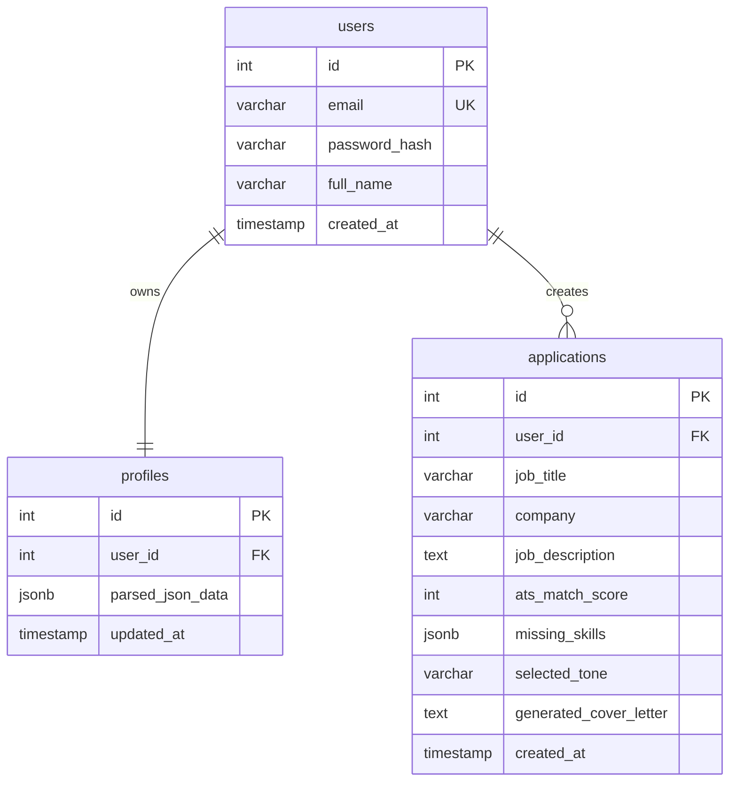

# Entity Relationship Diagram

## Relationship Notes

- Each user has one profile.
- Each user can create many job applications.
- Profiles are deleted automatically when their user is deleted.
- Applications are deleted automatically when their user is deleted.
- `profiles.parsed_json_data` stores structured CV data because CV sections can vary by user.
